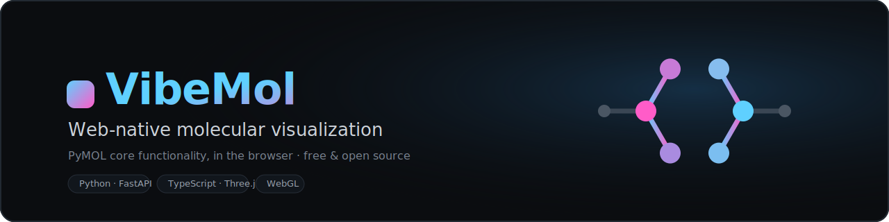

<p align="center">
  
</p>

<p align="center">
  <a href="LICENSE"></a>
  <a href="https://github.com/Betaglutamate/vibemol/actions/workflows/ci.yaml"></a>
  
  
  
  <a href="CONTRIBUTING.md"></a>
</p>

<p align="center">
  A free, open-source, <b>web-native molecular viewer</b> — PyMOL's core functionality, in the browser.<br>
  Run it on your laptop or in the cloud, drive it with a PyMOL-compatible command console, and extend it.
</p>

---

## Why

PyMOL is the de-facto desktop tool for molecular visualization, but it's heavyweight to install,
awkward to embed, and hard to extend. **VibeMol** mirrors its essentials in a zero-install web app
that is MIT-licensed and built from the ground up to be expanded by a community.

```
   browser (Three.js renderer · owns the camera)  ◀──WebSocket──▶  python (FastAPI · owns the scene)
        WebGL · instant interaction                                parsing · selections · geometry
```

Heavy work (parsing, atom selections, surfaces, cartoons) runs **server-side in Python**; the
browser just renders with **WebGL**. No server GPU required — it scales cheaply in the cloud and
runs on any laptop.

## Features

**Structures & I/O**
- Load **PDB** and **XYZ** out of the box; **mmCIF / SDF / MOL2** via the optional `science` extra
- **Fetch** structures from the RCSB PDB by id, or **drag & drop** a file
- Multi-model files become **trajectories** (frame slider + playback)
- Save/restore sessions to a portable **`.vibe`** file

**Representations**
- Lines · Sticks · Ball-and-stick · Spheres · Nonbonded · Dots
- **Cartoon** (secondary-structure ribbon with β-arrowheads; the protein default)
- **Molecular surface** (Gaussian density + marching cubes)
- Coloring by **element**, **chain**, **b-factor spectrum**, or any solid color

**Selections & analysis**
- A real **PyMOL-style selection language**: `resn`, `resi`, `chain`, `name`, `elem`, `b`/`q`,
  ranges, wildcards, `and`/`or`/`not`, `byres`, `within … of`, `around`, and **named selections**
- **Measurements** — distance, angle, dihedral, and polar contacts (dashed lines + labels)
- **Alignment** — Kabsch superposition + RMSD
- **Click-to-pick** atoms, 3D selection highlighting, and a **sequence viewer**

**Interface**
- A modern app shell: tool panel, data panel, and a **command console** (with history)
- Interactive selection management — target a selection, then recolor / re-represent / rename it
- **PNG snapshot** export and a high-quality **SSAO** rendering toggle

## Quick start

Requires **Python 3.11+** and **Node 18+**.

```bash
# 1. Backend (the `vibemol` package)
python3 -m venv .venv && source .venv/bin/activate
pip install -e "packages/backend[dev]"          # add [science] for mmCIF/SDF/MOL2 + surfaces

# 2. Frontend (builds into the backend's static dir)
cd packages/frontend && npm install && npm run build && cd -

# 3. Run — serves the app + API on http://localhost:8000
vibemol serve
```

Open **http://localhost:8000**, hit **Demo** (or **Fetch** a PDB id like `1ubq`), and try the console:

```text
fetch 1ubq
as cartoon
color spectrum
select site, byres (resn HOH around 4)
show sticks, site
distance index 10, index 120
```

For frontend hot-reload during development, run `npm run dev` in `packages/frontend` (it proxies
the API/WebSocket to the backend on port 8000).

## Architecture

The **backend owns the scene** (objects, per-atom representations, colors, selections, settings);
the **frontend owns the camera**, so orbit/zoom/pan never round-trip. Commands mutate the scene
server-side, which then streams compact **binary geometry buffers** to the client.

See [ARCHITECTURE.md](ARCHITECTURE.md) for the full design, the wire protocol, and the roadmap.

```
packages/
  backend/vibemol/   FastAPI server · parsers · selection engine · geometry · commands · analysis
  frontend/src/      Three.js renderer · WebSocket client · app-shell UI
```

## Roadmap

| Phase | Status | Highlights |
|------|--------|-----------|
| 0 · Foundations | ✅ | Monorepo, server + WebSocket, end-to-end walking skeleton |
| 1 · Core (MVP) | ✅ | Selection engine, representations, coloring, command console, sessions |
| 2 · Advanced | ✅ | Cartoon, surfaces, measurements, alignment, picking, trajectories, SSAO |
| 3 · Extensibility | ⏳ | Plugin system, `.pml` scripting, public protocol + client SDKs |
| 4 · Productionization | ⏳ | Auth/workspaces, real-time collaboration, embeddable widget, desktop build |

## Contributing

Contributions are welcome — see [CONTRIBUTING.md](CONTRIBUTING.md) for local setup and the quality
gates (ruff · mypy · pytest on the backend; eslint · tsc · vitest on the frontend).

## License

[MIT](LICENSE) — © 2026 VibeMol contributors.
